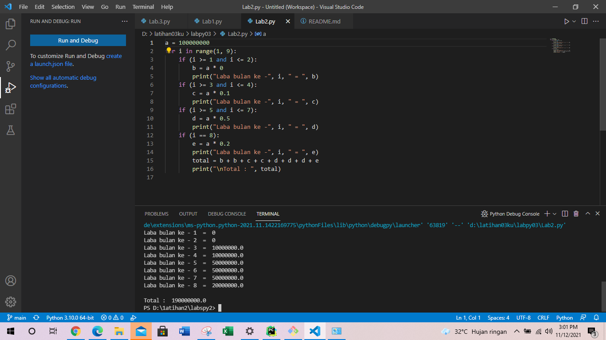

# labpy03
## Tugas Pertemuan ke 7
Latihan Lab1.py

1.Tampilkan n bilangan acak yang lebih kecil dari 0.5.

2.nilai n diisi pada saat runtime

3.anda bisa menggunakan kombinasi while dan for untuk menyelesaikannya

4.gunakan fungsi random() yang dapat diimport terlebih dahulu Berikut untuk gambar program nya:

Berikut untuk Algoritma beserta program nya:

import random

    print(40 * "=")
    print("Bilangan random yang lebih kecil dari 0,5")
    print(40 * "=")
    jum = int(input("Masukan nilai n : "))
    i = 0
    for i in range(jum):
    i += 1
    angkaDec = random.uniform(0, 0.5)
    print("Data ke", i, " = ", angkaDec)

Algoritma nya:

"print" : berfungsi untuk mencetak atau menampilkan objek ke perangkat keluaran (layar) atau ke file teks.

"import" : fungsi lanjut yang dipanggil oleh statement import.

"random" : untuk menentukan suatu pilihan.

"range" : merupakan fungsi yang menghasilkan list. Fungsi ini akan menciptakan sebuah list baru dengan rentang nilai tertentu.

"uniform": digunakan untuk menampilkan bilangan float random dengan batas awal bilangan x, dan batas akhir bilangan y.
2.Algoritma,Program beserta hasil output dari lab2.py:

print("Tugas Pertemuan 7 - Praktikum 3 - Lab2.py")

    xangka=0
    while True:
    xbilangan = int(input("Masukkan Bilangan : "))
    if (xangka < xbilangan):
        xangka=xbilangan
    if (xbilangan == 0):
        break

    print("Bilangan terbesar adalah: ",xangka)
    print()
 Berikut adalah Algoritma nya

"while" : disebut uncounted loop (perulangan yang tak terhitung), untuk perulangan yang memiliki syarat dan tidak tentu berapa banyak perulangannya.

"int" : berfungsi mengkonversi bilangan maupun string angka menjadi bilangan bulat (integer).

"if" = Bila suatu kondisi tertentu tercapai maka apa yang harus dilakukan. Dengan fungsi ini kita bisa menjalankan suatu perintah dalam kondisi tertentu.

"input" : masukan yang kita berikan ke program.

"break" : fungsi yang menghentikan operasi dibawahnya jika suatu kondisi yang ditentukan telah tercapai.

"print" : berfungsi untuk mencetak atau menampilkan objek ke perangkat keluaran (layar) atau ke file teks.
Program Di Visual Studio Code

Berikut untuk Algoritma nya:

program dalam bentuk script nya:

    a = 100000000
    for i in range(1, 9):
    if (i >= 1 and i <= 2):
    b = a * 0
    print("Laba bulan ke -", i, " = ", b)
    if (i >= 3 and i <= 4):
    c = a * 0.1
    print("Laba bulan ke -", i, " = ", c)
    if (i >= 5 and i <= 7):
    d = a * 0.5
    print("Laba bulan ke -", i, " = ", d)
    if (i == 8):
    e = a * 0.2
    print("Laba bulan ke -", i, " = ", e)
    total = b + b + c + c + d + d + d + e
    print("\nTotal : ", total)

Dan ini adalah algoritma nya:

1.masukkan nilai a

2.gunakan for untuk perulangan dari 1 sampai 8.Perulangan for disebut counted loop (perulangan yang terhitung)

3.lalu gunakan if pertama untuk menentukan laba bulan ke 1 dan ke 2.masukan variabel (b) kalikan nilai (a) dengan data bulan 1 dan 2. cetak (x) dan (b)

4.lalu gunakan if kedua untuk menentukan laba bulan ke 3 dan ke 4.masukan variabel (b) kalikan nilai (a) dengan data bulan 3 dan 4. cetak (x) dan (c)

5.lalu gunakan if ketiga untuk menentukan laba bulan ke 5 sampai ke 7.masukan variabel (b) kalikan nilai (a) dengan data bulan 5 sampai 7. cetak (x) dan (d)

6.lalu gunakan if keempat untuk menentukan laba bulan ke 8.masukan variabel (b) kalikan nilai (a) dengan data bulan 8. cetak (x) dan (e)

7.lalu total keseluruhan.

8.cetak total
Sekian Terimakasih